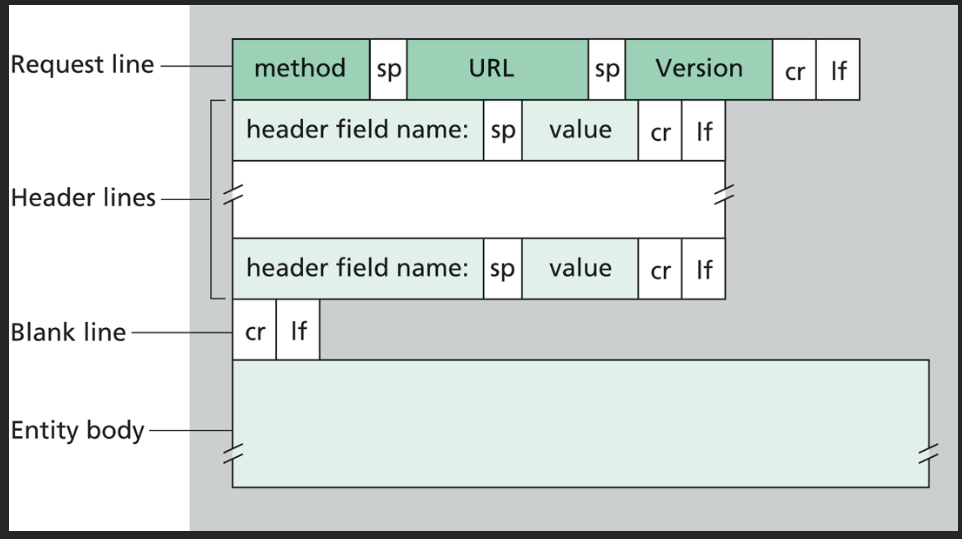
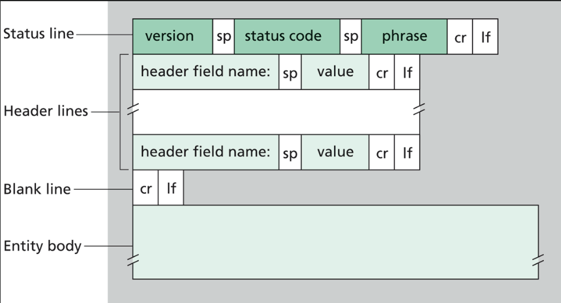
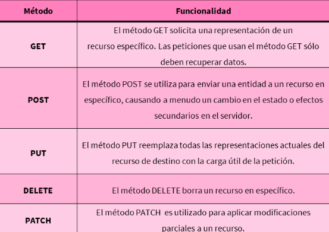

# Spring Boot

## Request
Una request que se lleva a cabo en una comunicación que utiliza el protocolo HTTP tiene una serie de partes. donde cada una de ellas cumple una funcionalidad distinta para poder cumplir con la correcta transmision del mensake que se desea dar a conocer desde el cliente hacia el servidor.

Que estas son:

Método: Se utiliza para indicar bajo que método o verbo HTTP se enviará un mensaje. HTTP Utiliza varios de estos dependiendo de la acción que el cliente solicitará realizar al servidor. Los más conocidos suelen ser: GET, POST, PUT, DELETE.

Url: Hace referencia a la dirección en donde se encuentra el servidor y a la cual el cliente está enviando la solicitud o request.

Header o cabecera: Contiene atributos o especificaciones necesarias para una correcta comunicación, por ejemplo, el lenguaje en que se están comunicando, tipo o formato de los datos (JSON. XML, etc), si se utiliza autentificacion o no, entre otros detalles.

Body o cuerpo: Es un campo opcional donde en caso de ser necesario puede incluirse objetos, textos o datos en particular que son necesarios transmitir en la solicitud. (campo opcional que complementa la cabecera o la url)

a cada solicitud(request) le corresponde una respuesta(response)

## Response 

son muy parecidos a las request, solo que tienen codigos de estatus (brindan un codigo que nos indica el estatus de nuestra transacción)

Status Codes: Es un código particular que indica informacion particular sobre si se pudo concluir con la solicitud enviada o no. Este código, dependiendo del tipo que sea, puede comunicar diferentes situaciones. Entre los más comunes se encuntran:

    100: Son respuesats de tipo informativas. Generalmente se utilizan para informar que una solicitud esta siendo procesada.

    200: Se utiliza para comunicar que una solicitud fue procesada correctamente. El más conocido o utilizado es el 200 Success.

    300: Para informar que se producirá una redirección.

    400: Son utilizados para representar errores causados principalmente por la solicutud del cliente. Entre los más conocidos se encuentra el famoso error 404 Not Found.

    500: Son utilizados para manifestar errores pero que fueron causados por el servidor, por ejemplo, si se producen errores de conexión, decaída momentánea de un recurso,. Uno de los más conocidos es el erroe 500 Internal Server Error.

Header o cabecera: Cumple con la misma función que en las request, conteniendo atributos o especificaciones necesarias para una correcta comunicación.

Body o cuerpo: Al igual que en las request, es un campo opcional con la finalidad de transportar datos u objetos (en caso de que sea necesario).

## Métodos más comunes

