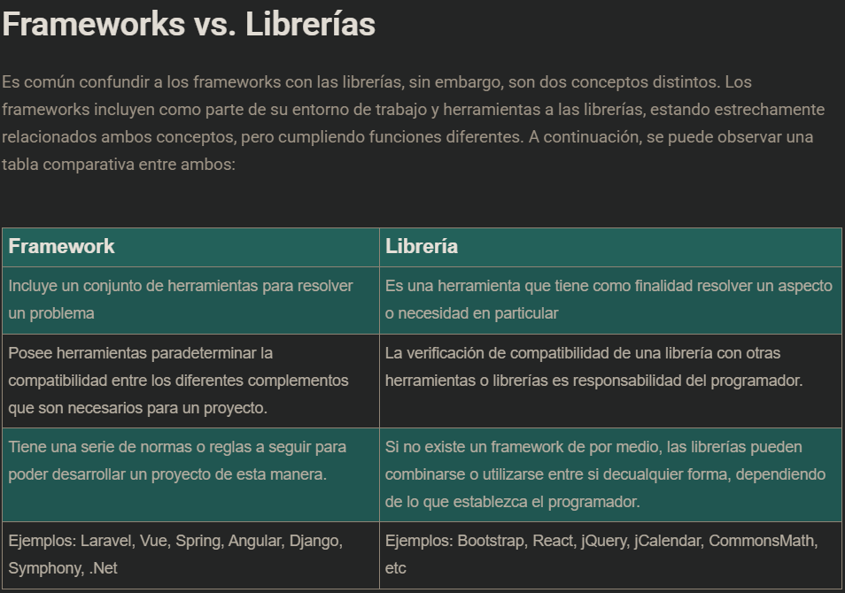
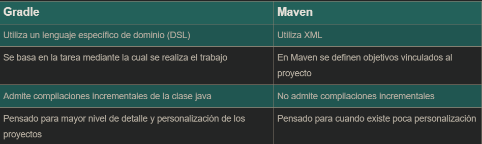
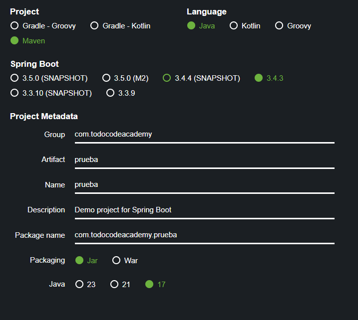
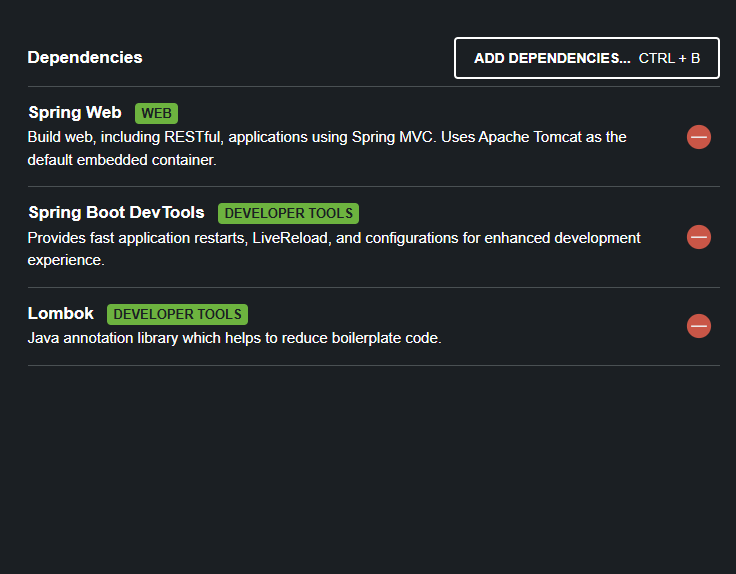
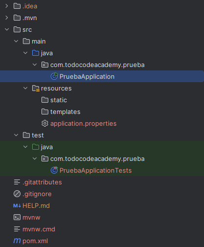
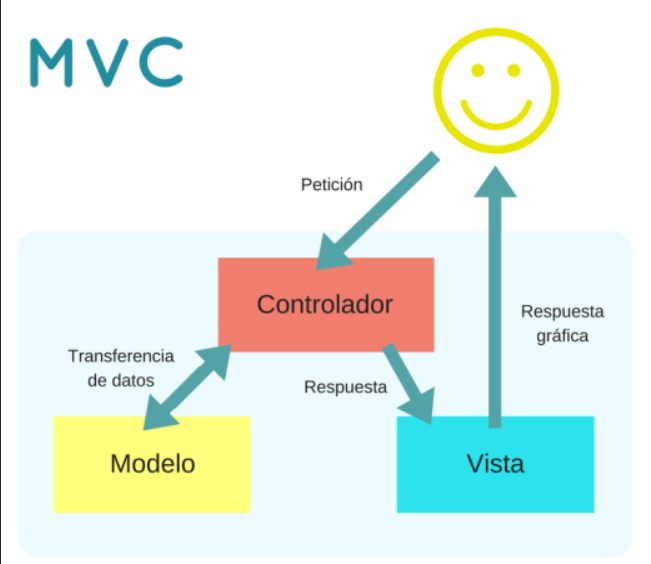

# Spring Boot

## Request
Una request que se lleva a cabo en una comunicación que utiliza el protocolo HTTP tiene una serie de partes. donde cada una de ellas cumple una funcionalidad distinta para poder cumplir con la correcta transmision del mensake que se desea dar a conocer desde el cliente hacia el servidor.

Que estas son:

Método: Se utiliza para indicar bajo que método o verbo HTTP se enviará un mensaje. HTTP Utiliza varios de estos dependiendo de la acción que el cliente solicitará realizar al servidor. Los más conocidos suelen ser: GET, POST, PUT, DELETE.

Url: Hace referencia a la dirección en donde se encuentra el servidor y a la cual el cliente está enviando la solicitud o request.

Header o cabecera: Contiene atributos o especificaciones necesarias para una correcta comunicación, por ejemplo, el lenguaje en que se están comunicando, tipo o formato de los datos (JSON. XML, etc), si se utiliza autentificacion o no, entre otros detalles.

Body o cuerpo: Es un campo opcional donde en caso de ser necesario puede incluirse objetos, textos o datos en particular que son necesarios transmitir en la solicitud. (campo opcional que complementa la cabecera o la url)


a cada solicitud(request) le corresponde una respuesta(response)

## Response 

son muy parecidos a las request, solo que tienen codigos de estatus (brindan un codigo que nos indica el estatus de nuestra transacción)

Status Codes: Es un código particular que indica informacion particular sobre si se pudo concluir con la solicitud enviada o no. Este código, dependiendo del tipo que sea, puede comunicar diferentes situaciones. Entre los más comunes se encuntran:

100: Son respuesats de tipo informativas. Generalmente se utilizan para informar que una solicitud esta siendo procesada.

200: Se utiliza para comunicar que una solicitud fue procesada correctamente. El más conocido o utilizado es el 200 Success.

300: Para informar que se producirá una redirección.

400: Son utilizados para representar errores causados principalmente por la solicutud del cliente. Entre los más conocidos se encuentra el famoso error 404 Not Found.

500: Son utilizados para manifestar errores pero que fueron causados por el servidor, por ejemplo, si se producen errores de conexión, decaída momentánea de un recurso,. Uno de los más conocidos es el erroe 500 Internal Server Error.

Header o cabecera: Cumple con la misma función que en las request, conteniendo atributos o especificaciones necesarias para una correcta comunicación.

Body o cuerpo: Al igual que en las request, es un campo opcional con la finalidad de transportar datos u objetos (en caso de que sea necesario).


## Métodos más comunes


## Librerias vs frameworks

Las librerias son porciones de codigo que se pueden reutilizar, que alguien ya codifico y que pueden ser reutilizadas

Los frameworks son entornos de desarrollo y buscan reducir el tiempo de desarrollo ocupando conjuntos de librerias y herramientas.



## Maven 

Es un gestor de librerias y dependencias sin necesidad de descargarla manualmente, es una herramienta de software para la géstion y construcción de proyecto Java que se caracteriza por tener un modelo de configuración muy simple. basado en el formato XML.

,aven utiliza el conocido archivo POM.xml para dentro de él especificar las diferentes dependencias o librerías que serán necesarias incluir en el proyecto que se esté desarrollando 



## Spring Boot

Spring Framework es un conjunto de proyectos open source desarrollados en Java con el objetivo de agilizar el proceso de desarrollo de aplciaciones.

Cuenta con una cantidad de herramientas que tienen como objetivo facilitar el trabajo de los desarrolladores.

Spring Boot es la herramienta para iniciar un proyecto web en spring, tiene un servidor embebido y ya la configuración por default.

Spring Boot es una extensión del framework Spring que tiene como finalidad simplificar la creación y configuración inicial de aplicaciones web.

Solo necesita una configuarcion basica, que permite el uso de librerias, integración ocn otras herramientras o incluso otros proyectos de Spring.

## Inicializar nuestros proyectos 

https://start.spring.io/ (aqui se inicializan los proyectos)

Los proyectos de spring boot tienen una cierta arquitectura que se tiene que seguir, unas carperpetas y asi, por ende es necesario poner bien los metadatos, que son los campos a llenar dentro de Spring Initializr 

Group: url de la aplicación, aqui es donde se va a guardar todo el proyecto (la url debe ir al revez)

Artifact: Nombre que le queremos incorporar a nuestro proyecto 



Las dependencias son las "librerias que vamos a incorporar a nuestro proyecto, aqui muestro las 2 primeras que son las más importantes y la de lombok es para no crear los seters ni geters dentro de nuestros programas 



## Estructura del proyecto 

tenemos en la carpeta src nuestro main, de la aplicacion, la aplicacion sabe que la aplicacion es en spring Boot por la anotacion @SpringBootAplication 




## Modelo MMC 

El Modelo Vista Controlador, mejor conocido como MVC, es un patrón de diseño de software que permite una separacion entre la logica de negocio de una aplciación y la vista que se le presenta al usauario, utilizando como intermediario a un controlador que se encarga de tomar la decision de cómo interactuan la vista y el modelo entre si.

En este patrón, el usuario realiza una peticion, un controlador la recibe y decide hacia donde debe ir la misma o qué acciones deben realizarse para emitir una respuesta.

Cada una de las partes del patrón cumpele con una funcionalida en particular:

Controlador: Se encarga de "Controlar" o hacer de intermediario; recibe las órdenes del usuario, solicita los adatos al modelo y se los comunica a la vista. Trbaja copmo si se tratara de un "pivote" que se encarga de distribuir las tareas. En SpringBoot se determina la clase controladora mediante la Annotation @RestController.

Modelo: Se encarga del modelo de los datos. En él se encuentra generalmente la lógica de usuario y las fuentes de datos, como por ejemplo, el consumo de datos desde una base de datos en particular.

Vista: Es la interfaz gráfica que se le presenta al usuario. Generalmente recibe datos provenientes del modelo a través del controlador y se los muestra al usuario en cuestión.



## API 

Permite que varias aplicaciones se puedan comunicar entre si, por más que estén desarrolladas en lenguajes de programacion completamente distintos.

Los programadores backend son los que desarrollan las apis, creando endpoints, para que el front pueda comunicarse con el back 

REST es un tipo de servicio que se caracteriza por no tener estado alguno y por lograr interconexiones mediante el protocolo HTTP con mensajes de tipo XML o JSON, la api necesita una serie de datos que yo le pase desde el front a traves de una solicitud, para poder trabajar desde la logica y poder regresarla.

los navegadores se comunican por default con GET

## Haciendo un controlador

para hacer un controlador (para continuar con el modelo MVC) se crea un nuevo paquete de controladores y al principio de este debe ponerse @RestController para que pueda ser identificado como un controlador

```java
package com.todocodeacademy.prueba.controller;

import org.springframework.web.bind.annotation.GetMapping;
import org.springframework.web.bind.annotation.RestController;

//se le pone Rest controller para que se identifique que es un controlador
@RestController
public class HellowController {

    //@GetMapping es para procesar las peticiones Get
    @GetMapping
    public String sayHellow(){
        return "Hola mundo";
    }
}
```
