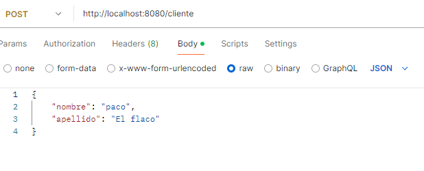
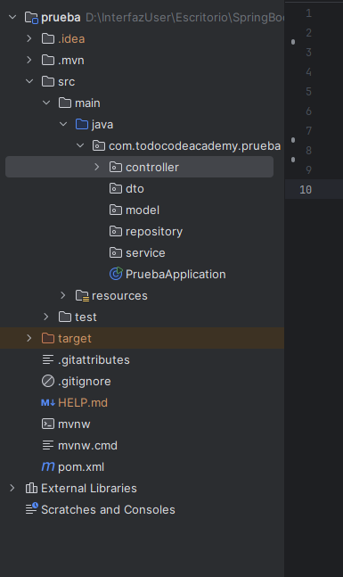
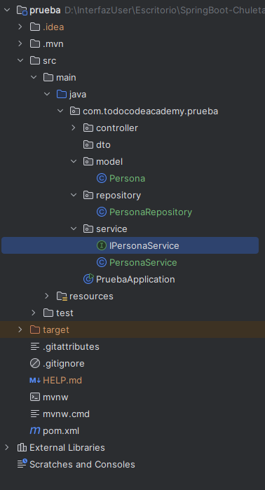
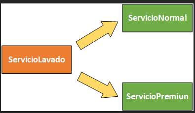
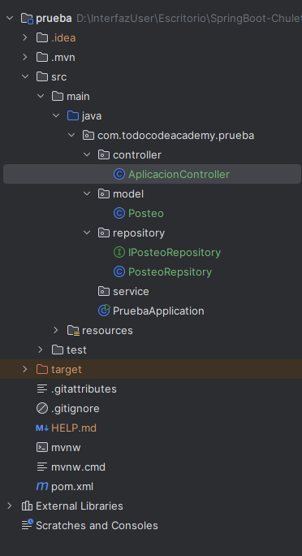
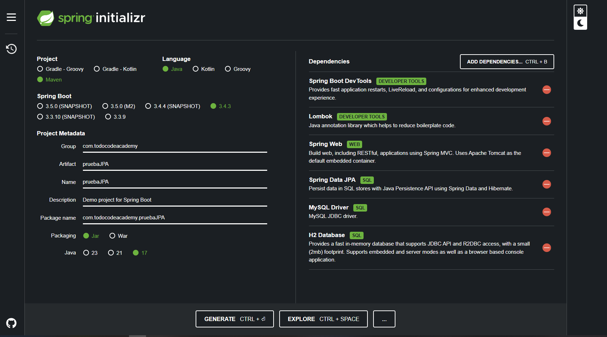
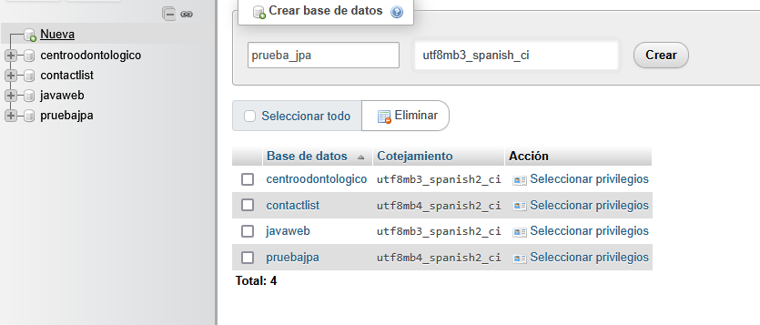
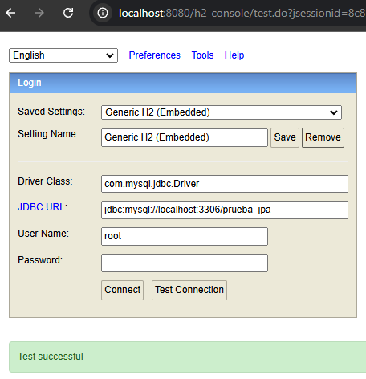
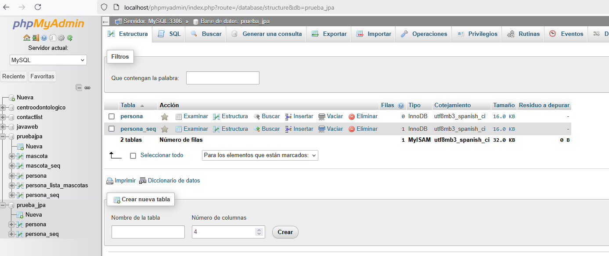
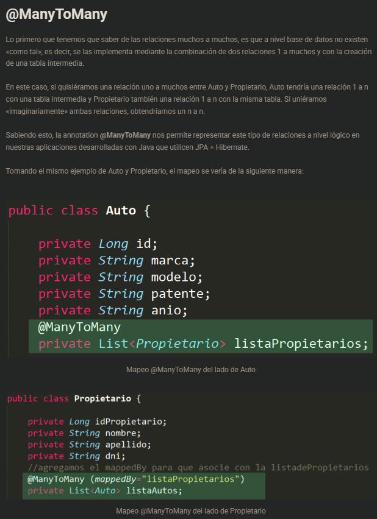

# Spring Boot

## Request
Una request que se lleva a cabo en una comunicación que utiliza el protocolo HTTP tiene una serie de partes. donde cada una de ellas cumple una funcionalidad distinta para poder cumplir con la correcta transmision del mensake que se desea dar a conocer desde el cliente hacia el servidor.

Que estas son:

Método: Se utiliza para indicar bajo que método o verbo HTTP se enviará un mensaje. HTTP Utiliza varios de estos dependiendo de la acción que el cliente solicitará realizar al servidor. Los más conocidos suelen ser: GET, POST, PUT, DELETE.

Url: Hace referencia a la dirección en donde se encuentra el servidor y a la cual el cliente está enviando la solicitud o request.

Header o cabecera: Contiene atributos o especificaciones necesarias para una correcta comunicación, por ejemplo, el lenguaje en que se están comunicando, tipo o formato de los datos (JSON. XML, etc), si se utiliza autentificacion o no, entre otros detalles.

Body o cuerpo: Es un campo opcional donde en caso de ser necesario puede incluirse objetos, textos o datos en particular que son necesarios transmitir en la solicitud. (campo opcional que complementa la cabecera o la url)


a cada solicitud(request) le corresponde una respuesta(response)

## Response 

son muy parecidos a las request, solo que tienen codigos de estatus (brindan un codigo que nos indica el estatus de nuestra transacción)

Status Codes: Es un código particular que indica informacion particular sobre si se pudo concluir con la solicitud enviada o no. Este código, dependiendo del tipo que sea, puede comunicar diferentes situaciones. Entre los más comunes se encuntran:

100: Son respuesats de tipo informativas. Generalmente se utilizan para informar que una solicitud esta siendo procesada.

200: Se utiliza para comunicar que una solicitud fue procesada correctamente. El más conocido o utilizado es el 200 Success.

300: Para informar que se producirá una redirección.

400: Son utilizados para representar errores causados principalmente por la solicutud del cliente. Entre los más conocidos se encuentra el famoso error 404 Not Found.

500: Son utilizados para manifestar errores pero que fueron causados por el servidor, por ejemplo, si se producen errores de conexión, decaída momentánea de un recurso,. Uno de los más conocidos es el erroe 500 Internal Server Error.

Header o cabecera: Cumple con la misma función que en las request, conteniendo atributos o especificaciones necesarias para una correcta comunicación.

Body o cuerpo: Al igual que en las request, es un campo opcional con la finalidad de transportar datos u objetos (en caso de que sea necesario).


## Métodos más comunes


## Librerias vs frameworks

Las librerias son porciones de codigo que se pueden reutilizar, que alguien ya codifico y que pueden ser reutilizadas

Los frameworks son entornos de desarrollo y buscan reducir el tiempo de desarrollo ocupando conjuntos de librerias y herramientas.


## Maven 

Es un gestor de librerias y dependencias sin necesidad de descargarla manualmente, es una herramienta de software para la géstion y construcción de proyecto Java que se caracteriza por tener un modelo de configuración muy simple. basado en el formato XML.

,aven utiliza el conocido archivo POM.xml para dentro de él especificar las diferentes dependencias o librerías que serán necesarias incluir en el proyecto que se esté desarrollando 


## Spring Boot

Spring Framework es un conjunto de proyectos open source desarrollados en Java con el objetivo de agilizar el proceso de desarrollo de aplciaciones.

Cuenta con una cantidad de herramientas que tienen como objetivo facilitar el trabajo de los desarrolladores.

Spring Boot es la herramienta para iniciar un proyecto web en spring, tiene un servidor embebido y ya la configuración por default.

Spring Boot es una extensión del framework Spring que tiene como finalidad simplificar la creación y configuración inicial de aplicaciones web.

Solo necesita una configuarcion basica, que permite el uso de librerias, integración ocn otras herramientras o incluso otros proyectos de Spring.

## Inicializar nuestros proyectos 

https://start.spring.io/ (aqui se inicializan los proyectos)

Los proyectos de spring boot tienen una cierta arquitectura que se tiene que seguir, unas carperpetas y asi, por ende es necesario poner bien los metadatos, que son los campos a llenar dentro de Spring Initializr 

Group: url de la aplicación, aqui es donde se va a guardar todo el proyecto (la url debe ir al revez)

Artifact: Nombre que le queremos incorporar a nuestro proyecto 


Las dependencias son las "librerias que vamos a incorporar a nuestro proyecto, aqui muestro las 2 primeras que son las más importantes y la de lombok es para no crear los seters ni geters dentro de nuestros programas 


## Estructura del proyecto 

tenemos en la carpeta src nuestro main, de la aplicacion, la aplicacion sabe que la aplicacion es en spring Boot por la anotacion @SpringBootAplication 


## Modelo MMC 

El Modelo Vista Controlador, mejor conocido como MVC, es un patrón de diseño de software que permite una separacion entre la logica de negocio de una aplciación y la vista que se le presenta al usauario, utilizando como intermediario a un controlador que se encarga de tomar la decision de cómo interactuan la vista y el modelo entre si.

En este patrón, el usuario realiza una peticion, un controlador la recibe y decide hacia donde debe ir la misma o qué acciones deben realizarse para emitir una respuesta.

Cada una de las partes del patrón cumpele con una funcionalida en particular:

Controlador: Se encarga de "Controlar" o hacer de intermediario; recibe las órdenes del usuario, solicita los adatos al modelo y se los comunica a la vista. Trbaja copmo si se tratara de un "pivote" que se encarga de distribuir las tareas. En SpringBoot se determina la clase controladora mediante la Annotation @RestController.

Modelo: Se encarga del modelo de los datos. En él se encuentra generalmente la lógica de usuario y las fuentes de datos, como por ejemplo, el consumo de datos desde una base de datos en particular.

Vista: Es la interfaz gráfica que se le presenta al usuario. Generalmente recibe datos provenientes del modelo a través del controlador y se los muestra al usuario en cuestión.


## API 

Permite que varias aplicaciones se puedan comunicar entre si, por más que estén desarrolladas en lenguajes de programacion completamente distintos.

Los programadores backend son los que desarrollan las apis, creando endpoints, para que el front pueda comunicarse con el back 

REST es un tipo de servicio que se caracteriza por no tener estado alguno y por lograr interconexiones mediante el protocolo HTTP con mensajes de tipo XML o JSON, la api necesita una serie de datos que yo le pase desde el front a traves de una solicitud, para poder trabajar desde la logica y poder regresarla.

los navegadores se comunican por default con GET

## Haciendo un controlador

para hacer un controlador (para continuar con el modelo MVC) se crea un nuevo paquete de controladores y al principio de este debe ponerse @RestController para que pueda ser identificado como un controlador

```java
package com.todocodeacademy.prueba.controller;

import org.springframework.web.bind.annotation.GetMapping;
import org.springframework.web.bind.annotation.RestController;

//se le pone Rest controller para que se identifique que es un controlador
@RestController
public class HellowController {

    //@GetMapping es para procesar las peticiones Get
    @GetMapping
    public String sayHellow(){
        return "Hola mundo";
    }
}
```

## @GetMapping, @PathVariable y @PathVariable
```java
package com.todocodeacademy.prueba.controller;

import org.springframework.web.bind.annotation.GetMapping;
import org.springframework.web.bind.annotation.PathVariable;
import org.springframework.web.bind.annotation.RequestParam;
import org.springframework.web.bind.annotation.RestController;

//se le pone Rest controller para que se identifique que es un controlador
@RestController
public class HellowController {

    /*si ninguno tienen ("/hello") o similar el get nos llevara por
    default a el metodo @GetMapping sin ()*/


    //para pasar variables existen path variable y el request param

    //@GetMapping es para procesar las peticiones Get
    @GetMapping("/hello/{nombre}")
    public String sayHellow(@PathVariable String nombre){
        return "Hola mundo" + nombre;
    }
    //este metodo debe tener este url para ejecutarse
    //localhost:8080/hello/un nombre

    //al poner las barras le decimos que metodo debe ejecutar dependiendo lo que entre a la url

    //Al poner Path Variable hacemos que el codigo espere la llegada de un valor por la url
    @GetMapping("/bye/{nombre}/{edad}/{profesion}")
    public String sayBye(@PathVariable String nombre,
                         @PathVariable int edad,
                         @PathVariable String profesion){
        return "Bye World" + " nombre: " + nombre + " Edad: " + edad + "profesion" + profesion;
    }
    //este metodo debe tener este url para ejecutarse
    //localhost:8080/hello/un nombre/una edad/ una profesion


    //ahoria utilizamos el request param para que se envie todo el paquete
    @GetMapping("/byebye")
    public String sayByeRequestParam(@RequestParam String nombre,
                                     @RequestParam int edad,
                                     @RequestParam String profesion){
        return "Bye World" + " nombre: " + nombre + " Edad: " + edad + "profesion" + profesion;
    }
    //este metodo debe tener este url para ejecutarse
    //localhost:8080/hello?nombre=unNombre&edad=unaEdad&profesion=unaProfesion


}
```

## JSON 

Javascript Object Notation, es un lenguaje intermediario entre el back y el front 


asi se definen los json, se distingue porque es una clave y un valor

```JSON
{   //asi se pone solo un parametro en json
    "nombre": "Cristiano",
    "apellido": "Ronaldo",
    "edad": 36,
    "equipo": ["Sporting Club", 
                "Manchester United"]
}
```

los corchetes significa que viene una lista, por ende podemos hacer esto:

```JSON
[{   //asi se pone solo un parametro en json
    "nombre": "Cristiano",
    "apellido": "Ronaldo",
    "edad": 36,
    "equipo": ["Sporting Club", 
                "Manchester United"]
},
{   
    "nombre": "Lionel",
    "apellido": "Messi",
    "edad": 34,
    "equipo": ["Newrlls", 
                "PSG"]
}
]
```

## Postman 

es una plataforma para simular las peticiones al backend

asi se hace un post, por medio del body de la request ya se utiliza dentro de nuestro back end, para decirlo de tra manera en el cuerpo de 
nuestra request se manda el obketo cliente




## @PostMapping y @RequestBody
```java
package com.todocodeacademy.prueba.controller;

import com.todocodeacademy.prueba.entitys.Cliente;
import org.springframework.web.bind.annotation.*;

//se le pone Rest controller para que se identifique que es un controlador
@RestController
public class HellowController {

    //esto sirve para recibir las peticiones post
    //al usar request body buscamos en el body de nuestra peticion
    @PostMapping("/cliente")
    public void CrearCliente(@RequestBody Cliente cliente){
        System.out.println("Cliente creado");
        System.out.println(cliente.getNombre());
    }

    
}
```

## @ResponseBody + ResponseEntity
```java
package com.todocodeacademy.prueba.controller;

import com.todocodeacademy.prueba.entitys.Cliente;
import org.springframework.web.bind.annotation.*;

//se le pone Rest controller para que se identifique que es un controlador
@RestController
package com.todocodeacademy.prueba.controller;

import com.todocodeacademy.prueba.entitys.Cliente;
import org.springframework.http.HttpStatus;
import org.springframework.http.ResponseEntity;
import org.springframework.web.bind.annotation.*;

import java.util.ArrayList;
import java.util.List;

@RestController
public class HellowController {

    //esto es la base de datos improvisada, esto no es lo correcto

    //ahora vamos a devolver datos

    @GetMapping("/cliente/traer")
    //responseBody se usa para indicar que devolvera algo en el cuerpo de la respuesta de la solicitud
    @ResponseBody
    public List<Cliente> traerCliente (){

        List<Cliente> listaClientes = new ArrayList<Cliente>();
        listaClientes.add(new Cliente(1L, "Zlatan", "Ibanover"));
        listaClientes.add(new Cliente(2L, "Cristiano", "Ronaldo"));
        listaClientes.add(new Cliente(3L, "Lionel", "Messi"));

        return listaClientes;
    }

    @GetMapping("/pruebaresponse")
    ResponseEntity<String> traerRespuesta(){
        //aqui se hace una respuesta personalizada, aqui se fuerza un estatus 200
        return new ResponseEntity<>("Esta es una prueba de response", HttpStatus.OK);
        //asi que con esto se puede forzar diferentes estatus para que podamos responder de manera más correcta
    }

    
}
```
## DTO data transfer object 

es un patron de diseño, esto es para unificar las tablas que tiene desde el 
lado del back. es una clase intermediaria, el dto sigue respondiendo lo mismo aunque 
las clases se cambien  

### Inquilino
```java
package com.todocodeacademy.prueba.entitys;

import lombok.Getter;
import lombok.Setter;

@Getter
@Setter
public class Inquilino {

    private Long id_inquilino;
    private String dni;
    private String nombre;
    private String apellido;
    private String profesion;

    public Inquilino() {
    }

    public Inquilino(Long id_inquilino, String dni, String nombre, String apellido, String profesion) {
        this.id_inquilino = id_inquilino;
        this.dni = dni;
        this.nombre = nombre;
        this.apellido = apellido;
        this.profesion = profesion;
    }
}

```

### Propiedad
```java
package com.todocodeacademy.prueba.entitys;

import lombok.Getter;
import lombok.Setter;

@Getter
@Setter
public class Propiedad {
    private Long id_propiedad;
    private String tipo_propiedad;
    private String direccion;
    private Double metros_cuadrados;
    private Double valor_alquiler;

    public Propiedad() {
    }

    public Propiedad(Long id_propiedad, String tipo_propiedad, String direccion, Double metros_cuadrados, Double valor_alquiler) {
        this.id_propiedad = id_propiedad;
        this.tipo_propiedad = tipo_propiedad;
        this.direccion = direccion;
        this.metros_cuadrados = metros_cuadrados;
        this.valor_alquiler = valor_alquiler;
    }
}
```

### Clase dto que unifica las clases 
```java
package com.todocodeacademy.prueba.entitys;

//Esta sera la clase DTO de propeidad, por ende tendra los valores de la propiedad, pero a la vez
//tambien tendra informacion extra, ya que al ser un dto es la que junta esta informacion

import lombok.Getter;
import lombok.Setter;

//sera una mezcla entre propiedad e inquilino
@Getter
@Setter
public class PropiedadDTO {

    private Long id_propiedad;
    private String tipo_propiedad;
    private String direccion;
    private Double valor_alquiler;
    private String nombre;
    private String apellido;

    public PropiedadDTO() {
    }

    public PropiedadDTO(Long id_propiedad, String tipo_propiedad, String direccion, Double valor_alquiler, String nombre, String apellido) {
        this.id_propiedad = id_propiedad;
        this.tipo_propiedad = tipo_propiedad;
        this.direccion = direccion;
        this.valor_alquiler = valor_alquiler;
        this.nombre = nombre;
        this.apellido = apellido;
    }
}

```

### Controlador que unifica las clases
```java
package com.todocodeacademy.prueba.controller;

import com.todocodeacademy.prueba.entitys.Inquilino;
import com.todocodeacademy.prueba.entitys.Propiedad;
import com.todocodeacademy.prueba.entitys.PropiedadDTO;
import org.springframework.web.bind.annotation.*;

@RestController
public class HellowController {

    @GetMapping("/propiedad/{id}")
    @ResponseBody
    public PropiedadDTO devolverPropiedad(@PathVariable Long id){
        //que a traves de la id buscamos la propiedad
        //trajimos al inquilino asociado a esa propiedad

        //esto es la simulacion de un objeto propiedad que nos trae la base de datos
        Propiedad prop = new Propiedad(15487L, "Casa", "308 Negro Arroyo Lane", 2000.0, 40000.0 );

        Inquilino inqui = new Inquilino(1L, "12345678", "Walter", "White", "Profesor de quimica");

        PropiedadDTO propiDTO = new PropiedadDTO();

        //asignamos los datoq ue necesitamos de propiedad
        propiDTO.setId_propiedad(prop.getId_propiedad());
        propiDTO.setTipo_propiedad(prop.getTipo_propiedad());
        propiDTO.setDireccion(prop.getDireccion());
        propiDTO.setValor_alquiler(prop.getValor_alquiler());
        //asignamos los datos que necesitamos de inquilino
        propiDTO.setNombre(inqui.getNombre());
        propiDTO.setApellido(inqui.getApellido());

        return propiDTO;
    }
}

```

## Arquitectura multicapas

Es una manera de organizar el codigo que tenemos 

tenemos algunos paquetes que son los mas prototipados en el desarrollo de software

* Controller 
  * Atiende las solicitudes http entrantes para derivar a la capa que corresponde y dar un resultado
* Repository o DAO (Data Acces Object)
  * Manejo de persistencia con los datos o con las bases de datos
* Model (o Entity)
  * Clases estandares que tiene el proyecto
* DTO (Data Transfer Object)
  * Todos los dto
* Service
  * trabaja todos loas pasos logicos de nuestro programa 

### Arquitectura



## Arq.Multicapas: @Repository y @Service


### Persona
```java
package com.todocodeacademy.prueba.model;

import lombok.Getter;
import lombok.Setter;

//no es necesario poner algun tipo de anotacion a las clases porque se identifican por default
@Getter
@Setter
public class Persona {
    private Long id;
    private String nombre;
    private String apellido;

    public Persona() {
    }

    public Persona(Long id, String nombre, String apellido) {
        this.id = id;
        this.nombre = nombre;
        this.apellido = apellido;
    }
}
```

### PersonaRepository
```java
package com.todocodeacademy.prueba.repository;

import org.springframework.stereotype.Repository;

//al poner esta anotation le decimos que es un repositorio
@Repository
public class PersonaRepository {

    //metodos para llamara a la base de datos, etc
}

```

### PersonaService
```java
package com.todocodeacademy.prueba.service;

import com.todocodeacademy.prueba.model.Persona;

import java.util.List;

public interface IPersonaService {

    //esto se hace para separar los metodos propios y su implementacion
    public void crearPersona(Persona per);

    public List<Persona> traerPersonas();
}
```

### IPersonaService
```java
package com.todocodeacademy.prueba.service;

import com.todocodeacademy.prueba.model.Persona;
import org.springframework.stereotype.Service;

import java.util.List;

//con la anotation le decimos que es un service
@Service
public class PersonaService implements IPersonaService {
    //todos los metodos de logica de negocio

    @Override
    public void crearPersona(Persona per) {
        System.out.println("Persona Creada");
    }

    @Override
    public List<Persona> traerPersonas() {
        //aca deberia ir la logica de devolver la lista de personas
        return List.of();
    }
}
```

### Arquitectura del proyecto



## Inyección de Dependencias 
en ningun momento busca usar la palabra new para crear más clases si no que utiliza lo que ya tiene

Su principal obketivo es el de mantener las capas de una aplicacion lo más desacopladas
psoible entre si 

Para poder lograr esto, la inyección de dependencias permite que cada una de las partes del programa 
que se esté desarrollando sea independiente y que no se comuniquen entre si mediante instancias,
sino mediante interfaces 

cada vez que utilizamos el new es que creamos una nueva instancia de una clasem lo que se busca es no llenar
la memoria de la aplicacion con clases

se puede hacer inyeccion de dependencia mediante 

* Constructores
* Mediante setters
* Mediante el @Autowired

en esta ocacion veremos las 2 clases primeras

Supongamos que tenemos el modelado de un lavadero de autos, donde existe una clkase llamda ServicioLavado de la cualdependen dos clases
Servicio normal y Servicio Premiun 



### Clase ServicioLavado

```java
package com.todocodeacademy.prueba.model;

public class ServicioLavado {
    private ServicioNormal servicioNormal;
    private ServicioPremiun servicioPremiun;

    //inyeccion de dependencias en el constructor
    public ServicioLavado(ServicioNormal servicioNormal, ServicioPremiun servicioPremiun) {
        this.servicioNormal = servicioNormal;
        this.servicioPremiun = servicioPremiun;
    }

    //inyeccion de dependencias por setters
    public void setServicioNormal(ServicioNormal servicioNormal) {
        this.servicioNormal = servicioNormal;
    }

    public void setServicioPremiun(ServicioPremiun servicioPremiun) {
        this.servicioPremiun = servicioPremiun;
    }
}

```

las otras clases estan completamente vacias, solo se crearon, pero estan en blanco 


## @Autowired

Lo ideal debe ser generar la inyeccion al service y del service al repository, pero apra no tardar tanto en el ejemplo se salta directamente al repository




### AplicationController
```java
package com.todocodeacademy.prueba.controller;

import com.todocodeacademy.prueba.model.Posteo;
import com.todocodeacademy.prueba.repository.IPosteoRepository;
import org.springframework.beans.factory.annotation.Autowired;
import org.springframework.web.bind.annotation.GetMapping;
import org.springframework.web.bind.annotation.RestController;

import java.util.List;

@RestController
public class AplicacionController {

    @Autowired
    //llamamaos a la interfaz para que llame a la clase que la implementa
    IPosteoRepository repo;

    @GetMapping("/posteos")
    public List<Posteo> traerTodos(){
        return  repo.traerTodos();
    }

}

```

### Posteo
```java
package com.todocodeacademy.prueba.model;

import lombok.Getter;
import lombok.Setter;

@Setter
@Getter
public class Posteo {

    private Long id;
    private String titulo;
    private String autor;

    public Posteo() {
    }

    public Posteo(Long id, String titulo, String autor) {
        this.id = id;
        this.titulo = titulo;
        this.autor = autor;
    }
}

```

### PosteoRepository
```java
package com.todocodeacademy.prueba.repository;

import com.todocodeacademy.prueba.model.Posteo;

import java.util.List;

public interface IPosteoRepository {

    public List<Posteo> traerTodos();
}

```

### IPosteoRepository
```java
package com.todocodeacademy.prueba.repository;
import com.todocodeacademy.prueba.model.Posteo;
import org.springframework.stereotype.Repository;

import java.util.ArrayList;
import java.util.List;

@Repository
public class PosteoRepsitory implements IPosteoRepository{

    @Override
    public List<Posteo> traerTodos() {
        List<Posteo> listaPosteos = new ArrayList<Posteo>();

        listaPosteos.add(new Posteo(1L, "¿Como formatear una pec", "Luisina de Paula"));
        listaPosteos.add(new Posteo(1L, "¿Como mantener la seguridad", "Gabriel Guismin"));

        return listaPosteos;
    }
}

```

## ORM y JPA(Java persistence api)
JPA es un ORM (Object Relational Mapping) que tiene como objetivo logarr la persistencia de datos entre una aplicacion desarrolladas
en java y una base de datos

hibernate es un proveedor de jpa 


## Configuracion de Hibernate 

se genera la configuracion inicial, en ese caso hibernate se encuentra en la parte de Spring Data JPA

My SQL Driver es para tener un driver para sql y h2 Database es un sql embebido pequeño 


creamos la base de datos con la cual vamos a estar trabajando 



se deja vacio, solo se crea la base de datos ya que hibernate se debe de encargar de hacer las columnas necesaras para recibir 
de manera correcta los datos que le pasaremos 

ahora en el archivo de application properties vamos a poner las credenciales para que nuestro proyecto pueda conectarse a la base de datos 5 configuraciones

```java
spring.application.name=pruebaJPA

//para hacer el mapeo de la base de datos debe borrar lo que ya hay ahi o que hacer
//en este caso le decimos que lo actualice
spring.jpa.hibernate.ddl-auto=update


//url de nuestra base de datos
//cual va a ser la base de datos a utilizar
//y despues del ? es para eliminar el problema de la zona horaria
spring.datasource.url=jdbc:mysql://localhost:3306/prueba_jpa?seSSL=false&serverTimezone=UTC

//poner el nombre de usuario de la base de datos
spring.datasource.username=root

//poner la contraseña de la base de datos
spring.datasource.password=

//decirle en que dialecto se va a comunicar con la base de datos
spring.jpa.database-platform=org.hibernate.dialect.MySQLDialect
```

despues de esto levantamos la aplicacion y revisamos ques e pueda acceder a ella, para eso podemos hacer uso de la base de datos que ya teniamos embebida en la configuracion de springBoot, haciendo que despues de que levantemos la aplicacion poner el URL: http://localhost:8080/h2-console Y y la configuramos con los valores que le metismos a properties, el nombre y contraseña es admin y ponemos Test Connection 



la aplciacion llenara la base de datos sin tener que meter ningun tipo de query 

### Persona 
```java
package com.todocodeacademy.pruebaJPA.model;

import jakarta.persistence.Entity;
import jakarta.persistence.GeneratedValue;
import jakarta.persistence.GenerationType;
import jakarta.persistence.Id;
import lombok.Getter;
import lombok.Setter;

@Getter
@Setter

//con esta anotation le decimos que esto sera una tabla en la base de datos
@Entity
public class Persona {

    //este sera la primary key
    @Id
    //esta se generarara de manera secuencial
    @GeneratedValue(strategy = GenerationType.SEQUENCE)
    private Long id;
    private String nombre;
    private String apellido;
    private int edad;

    public Persona() {
    }

    public Persona(Long id, String nombre, String apellido, int edad) {
        this.id = id;
        this.nombre = nombre;
        this.apellido = apellido;
        this.edad = edad;
    }
}
```

### IPersonaRepository 
```java
package com.todocodeacademy.pruebaJPA.repository;

import com.todocodeacademy.pruebaJPA.model.Persona;
import org.springframework.data.jpa.repository.JpaRepository;
import org.springframework.stereotype.Repository;


//le decimos que sera un repositorio
@Repository
//aqui le decimos que extiende de una clase jpaRepository de Hibernate que ya se encarga de realizar la
//persistencia de lso datos, por ende solo hayq ue darle algunos pocos de parametros, como que tipo de
//entidad tenemos que eprsistir y de que tipo es su primary key
public interface IPersonaRepository extends JpaRepository<Persona,Long> {
}

```

### IPersonaService
```java
package com.todocodeacademy.pruebaJPA.service;

public interface IPersonaService {
}

```

### PersonaService
```java
package com.todocodeacademy.pruebaJPA.service;

import com.todocodeacademy.pruebaJPA.repository.IPersonaRepository;
import org.springframework.beans.factory.annotation.Autowired;
import org.springframework.stereotype.Service;

@Service
public class PersonaService {

    //inyectamos la dependencia que ya interactua con la base de datos
    @Autowired
    private IPersonaRepository personaRepository;
}

```

y queda de esta manera en el servidor, generando otra tabla de apoyo para la secuencia de los numeros que se le dara a nuestro id



## Creando un CRUD con JPA + Hibernate

CRUD
* Create
* Read
* Update
* Delete

se tiene que recordar que el controller llama a el service que es el encargado de hacer la logica, luego el service llama al repository que es el encargado de hacer la eprsistencia de datos

### PersonaController
```java
package com.todocodeacademy.pruebaJPA.controller;

import com.todocodeacademy.pruebaJPA.model.Persona;
import com.todocodeacademy.pruebaJPA.service.IPersonaService;
import com.todocodeacademy.pruebaJPA.service.PersonaService;
import org.springframework.beans.factory.annotation.Autowired;
import org.springframework.web.bind.annotation.*;

import java.util.List;

@RestController
public class PersonaController {

    @Autowired
    IPersonaService personaService;

    //obtener todas las personas
    @GetMapping("/persona/traer")
    public List<Persona> findAllPersonas(){
        return personaService.getPersonas();
    }

    //creando una persona
    @PostMapping("/persona/crear")
    public String savePersona(@RequestBody Persona perso){
        System.out.println("entrando al post");
        personaService.savePersona(perso);
        return "Persona creada con exito";
    }

    //eliminar persona
    @DeleteMapping("/persona/borrar/{id}")
    public String deletePersona(@PathVariable Long id){
        personaService.deletePersona(id);
        return "Persona eliminada con exito";
    }

    //obtener una sola persona
    @GetMapping("/{id}")
    public Persona findPersona(@PathVariable Long id){
        return personaService.findPersona(id);
    }

    //editando una persona
    @PutMapping("/persona/editar/{id_original}")
    public Persona editPersona(@PathVariable Long id_original,
                               //aqui especificamos que no es necesario introducir todos los valores
                               @RequestParam(required = false, name="id") Long nuevaId,
                               @RequestParam(required = false, name="nombre") String nuevoNombre,
                               @RequestParam(required = false, name="apellido") String nuevoApellido,
                               @RequestParam(required = false, name="edad") int nuevaEdad){

        personaService.editPersona(id_original,nuevaId,nuevoNombre,nuevoApellido,nuevaEdad);

        Persona persona = personaService.findPersona(nuevaId);

        return persona;
    }
}

```

### Persona
```java
package com.todocodeacademy.pruebaJPA.model;

import jakarta.persistence.Entity;
import jakarta.persistence.GeneratedValue;
import jakarta.persistence.GenerationType;
import jakarta.persistence.Id;
import lombok.Getter;
import lombok.Setter;

@Getter
@Setter

@Entity
public class Persona {

    @Id
    @GeneratedValue(strategy = GenerationType.SEQUENCE)
    private Long id;
    private String nombre;
    private String apellido;
    private int edad;

    public Persona() {
    }

    public Persona(Long id, String nombre, String apellido, int edad) {
        this.id = id;
        this.nombre = nombre;
        this.apellido = apellido;
        this.edad = edad;
    }
}

```

### IPersonaRepository
```java
package com.todocodeacademy.pruebaJPA.repository;

import com.todocodeacademy.pruebaJPA.model.Persona;
import org.springframework.data.jpa.repository.JpaRepository;
import org.springframework.stereotype.Repository;


@Repository
public interface IPersonaRepository extends JpaRepository<Persona,Long> {
}

```

### IPersonaService
```java
package com.todocodeacademy.pruebaJPA.service;

import com.todocodeacademy.pruebaJPA.model.Persona;

import java.util.List;

public interface IPersonaService {

    //traer todas las personas
    public List<Persona> getPersonas();

    //guardar una persona
    public void savePersona(Persona persona);

    //eliminar persona
    public void deletePersona(Long id);

    //encontrar una sola persona
    public Persona findPersona(Long id);

    //modificar un registro de la manera más agresiva
    public void editPersona(Long idOriginal, Long idNueva,
                            String nuevoNombre,
                            String nuevoApellido,
                            int nuevaEdad);
}

```

### PersonaService
```java
package com.todocodeacademy.pruebaJPA.service;
import com.todocodeacademy.pruebaJPA.model.Persona;
import com.todocodeacademy.pruebaJPA.repository.IPersonaRepository;
import org.springframework.beans.factory.annotation.Autowired;
import org.springframework.stereotype.Service;

import java.util.List;

@Service
public class PersonaService implements IPersonaService{

    @Autowired
    private IPersonaRepository personaRepository;

    @Override
    public List<Persona> getPersonas() {
        List<Persona> listaPersonas = personaRepository.findAll();
        return listaPersonas;
    }

    @Override
    public void savePersona(Persona persona) {
        personaRepository.save(persona);
    }

    @Override
    public void deletePersona(Long id) {
        personaRepository.deleteById(id);
    }

    @Override
    public Persona findPersona(Long id) {
        //busca la persona y si no la encuentra regresa un null
        return personaRepository.findById(id).orElse(null);
    }

    @Override
    public void editPersona(Long idOriginal, Long idNueva, String nuevoNombre, String nuevoApellido, int nuevaEdad) {
        Persona perso = this.findPersona(idOriginal);
        if (perso!=null){
            perso.setId(idNueva);
            perso.setNombre(nuevoNombre);
            perso.setApellido(nuevoApellido);
            perso.setEdad(nuevaEdad);
        }

        this.savePersona(perso);
    }
}

```

## Relaciones con JPA +Hibernate: @OneToOne + @OneToMany + @ManyToMany

### @OneToOne (uno a uno)

una persona solo puede tener una mascota, tenemos que ver de que lado tiene mpas sentido 
saber los datos, por ejemplo, en este caso a quien le importa saber sobre la mascota?, a la persisona 

### Persona
```java
package com.todocodeacademy.pruebaJPA.model;
import jakarta.persistence.*;
import lombok.Getter;
import lombok.Setter;

@Getter
@Setter

@Entity
public class Persona {

    @Id
    @GeneratedValue(strategy = GenerationType.SEQUENCE)
    private Long id;
    private String nombre;
    private String apellido;
    private int edad;

    //esta sera la mascota que tiene la persona
    //con el anotation le decimos que sea asi
    @OneToOne
    //join colum es para mapear de donde viene la referencia dada, y como debe de llamrase la columna en la base de datos
    @JoinColumn(name = "una_mascota_id_mascota", referencedColumnName = "id_mascota")
    private Mascota unaMascota;

    public Persona() {
    }

    public Persona(Long id, String nombre, String apellido, int edad) {
        this.id = id;
        this.nombre = nombre;
        this.apellido = apellido;
        this.edad = edad;
    }
}
```

### Mascota
```java
package com.todocodeacademy.pruebaJPA.model;


import jakarta.persistence.Entity;
import jakarta.persistence.GeneratedValue;
import jakarta.persistence.GenerationType;
import jakarta.persistence.Id;
import lombok.Getter;
import lombok.Setter;

@Setter
@Getter

@Entity
public class Mascota {
    @Id
    @GeneratedValue(strategy = GenerationType.SEQUENCE)
    private Long id_mascota;
    private String nombre;
    private String especie;
    private String raza;
    private String color;

    public Mascota(){

    }

    public Mascota(Long id_mascota, String nombre, String especie, String raza, String color) {
        this.id_mascota = id_mascota;
        this.nombre = nombre;
        this.especie = especie;
        this.raza = raza;
        this.color = color;
    }
}
```

tambien tenemos que tener en cuenta que para poder actualizar las clases es posible 
utilizar el save, ya que este sobreeescribe lo que tenemos en la base de datos 

### @OneToMany

una persona puede tener más de una mascota 

### Mascota
```java
package com.todocodeacademy.pruebaJPA.model;


import jakarta.persistence.*;
import lombok.Getter;
import lombok.Setter;

@Setter
@Getter

@Entity
public class Mascota {
    @Id
    @GeneratedValue(strategy = GenerationType.SEQUENCE)
    private Long id_mascota;
    private String nombre;
    private String especie;
    private String raza;
    private String color;

    @ManyToOne
    //le decimos que esta mascota (que sera parte de una lista de mascotas), tendra una persona asociada
    //haciendo la relacion bidireccional
    private Persona persona;

    public Mascota(){

    }

    public Mascota(Long id_mascota, String nombre, String especie, String raza, String color) {
        this.id_mascota = id_mascota;
        this.nombre = nombre;
        this.especie = especie;
        this.raza = raza;
        this.color = color;
    }
}

```

### Persona 
```java
package com.todocodeacademy.pruebaJPA.model;

import jakarta.persistence.*;
import lombok.Getter;
import lombok.Setter;

import java.util.List;

@Getter
@Setter

@Entity
public class Persona {

    @Id
    @GeneratedValue(strategy = GenerationType.SEQUENCE)
    private Long id;
    private String nombre;
    private String apellido;
    private int edad;

    //y tambien es importante recalcar que se hace atraves de una lista
    //esto nos genera una tabla extra (si no le ponemos el many to one en la otra parte de la relacion )
    @OneToMany
    private List<Mascota> listaMascotas;

    public Persona() {
    }

    public Persona(Long id, String nombre, String apellido, int edad) {
        this.id = id;
        this.nombre = nombre;
        this.apellido = apellido;
        this.edad = edad;
    }
}
```

### @ManyToMany
